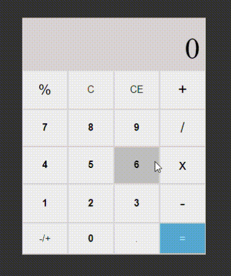

# Calculadora
O projeto foi feito utilizando HTML, CSS e JavaScript. Consiste em uma calculadora que realiza operações simples: adição, subtração, multiplicação, divisão, alteração de sinais e cálculo de porcentagem.

